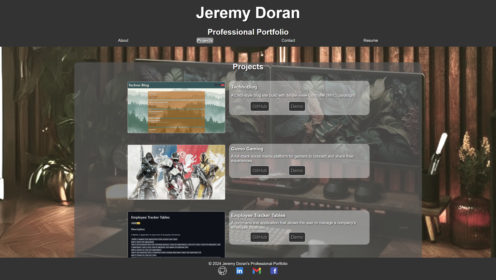

# Jeremy's Tech Portfolio
  
  </br>
  </br>
  </br>
  ## Description
  
  This application is a collection of Jeremy Doran's coding projects and applications. It is meant to be a portfolio of his work and a showcase of his skills as a full-stack web developer. The functionality of this site is meant to allow users to view his work and contact him for potential job opportunities. In order to build this application, it required knowledge of the MVC format as well as the common coding practices that are associated with that format style.
  </br>
  </br>
  </br>
  ## Table of Contents
  
  - [Description](#description)
  - [Table of Contents](#table-of-contents)
  - [Installation](#installation)
  - [Usage](#usage)
  - [Credits](#credits)
  - [Features](#features)
  - [How to Contribute](#how-to-contribute)
  - [Tests](#tests)
  - [License](#license)
  - [Questions](#questions)
  ## Installation
  
  No installation required. This is a web application that is hosted on the internet. If you would like to run this application locally, you can clone the repository and run `npm install` to install the necessary dependencies. Then you can run `npm run dev` to start the server and navigate to `localhost:3001` in your web browser to view the application.
  </br>
  </br>
  </br>
  ## Usage
  To utilize this application, you can navigate to the deployed site at <a href="https://jeremydoran.herokuapp.com/">Jeremy's Tech Portfolio</a>. Once there, you can view my work and contact me for potential job opportunities by utilizing the ```Contact``` page. Learn more about my by visiting the ```About``` page. You can also view my resume by clicking the ```Resume``` link in the navigation bar.

  
  </br>
  </br>
  </br>
  ## Credits
  
  - <a href="https://chat.openai.com/">ChatGPT 3.5</a>
  - <a href="https://github.com/features/copilot?ef_id=_k_CjwKCAiAq4KuBhA6EiwArMAw1FOutqMK0saZxH8FwReh32EgrB9jOkJA2Gi0O3-RqIINbuOsOHKHhxoCfKwQAvD_BwE_k_&OCID=AIDcmmc3fhtaow_SEM__k_CjwKCAiAq4KuBhA6EiwArMAw1FOutqMK0saZxH8FwReh32EgrB9jOkJA2Gi0O3-RqIINbuOsOHKHhxoCfKwQAvD_BwE_k_&gad_source=1&gclid=CjwKCAiAq4KuBhA6EiwArMAw1FOutqMK0saZxH8FwReh32EgrB9jOkJA2Gi0O3-RqIINbuOsOHKHhxoCfKwQAvD_BwE">Github CoPilot</a>
  - <a href="https://developer.mozilla.org/en-US/">MDN</a>
  - <a href="https://www.w3schools.com/">W3Schools</a>
  - <a href="https://stackoverflow.com/">Stack Overflow</a>
  - <a href="https://leewarrick.com/">Lee Warrick</a> UCONN Bootcamp Instructor
  - <a href="https://github.com/miacias">Mia Ciasullo</a> UCONN Bootcamp Instructor
  - <a href="https://github.com/samanthashleyrose">Samantha Rose</a> UCONN Bootcamp Student
  - <a href="https://icons8.com/">Icons8</a>
    - <a target="_blank" href="https://icons8.com/icon/P7UIlhbpWzZm/gmail">Gmail</a> icon by <a target="_blank" href="https://icons8.com">Icons8</a>
    - <a target="_blank" href="https://icons8.com/icon/s1rwrv9mNnN4/github">GitHub</a> icon by <a target="_blank" href="https://icons8.com">Icons8</a>
    - <a target="_blank" href="https://icons8.com/icon/13912/facebook">Facebook</a> icon by <a target="_blank" href="https://icons8.com">Icons8</a>
    - <a target="_blank" href="https://icons8.com/icon/xuvGCOXi8Wyg/linkedin">LinkedIn</a> icon by <a target="_blank" href="https://icons8.com">Icons8</a>
  </br>
  </br>
  </br>
  ## Features

  - An ```About``` page that showcases my work and provides a brief introduction to who I am.
  - A ```Contact``` page that allows users to send me an email directly from the site.
  - A ```Resume``` link that allows users to view my resume.
  - A ```Projects``` page that showcases my work and provides links to the deployed applications as well as the GitHub repositories.
  - A download link for my resume.
  - A navigation bar that allows users to easily navigate the site.
  - A footer that contains links to my social media profiles.
  </br>
  </br>
  </br>
  ## How to Contribute
  
  To contribute to this project, please contact the creator of this project via the contact information provided below.<br>Otherwise, feel free to fork the <a href="https://github.com/mighty-little-coder/jeremy-s_tech_portfolio">repository</a> and make changes as you see fit. If you think the changes would benefit the project, please submit a pull request.
  </br>
  </br>
  </br>
  ## Tests
  
  N/A
  </br>
  </br>
  </br>
  ## License
  
  This project is licensed under the MIT LICENSE - see the <a href="https://opensource.org/licenses/MIT">MIT LICENSE</a> file on OpenSourceInitiative.org for details.
  </br>
  </br>
  </br>
  ## Questions
  
  For further questions, please connect with me at <a href="https://github.com/mighty-little-coder">mighty-little-coder</a>,<br>
  or contact me via email at <a href="email@email.email">email@email.email</a>.
